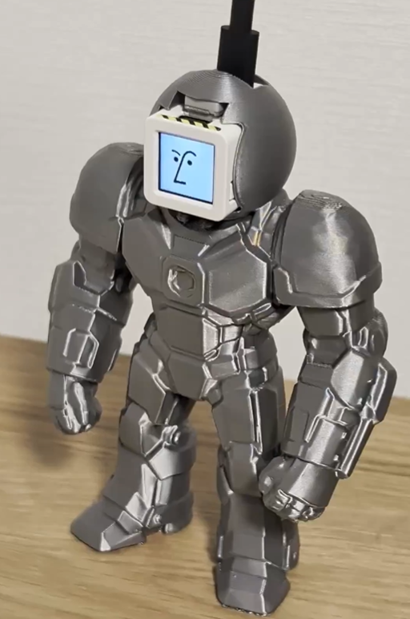

# しゃべれる Notion タスク投入ロボ

<p align="center">
  
</p>

M5Stack ATOM EchoS3R + ATOM S3 を使った、音声でNotion Custom Agentにタスクを投入するデモシステム。

## 動作フロー

```
[EchoS3R] 音声検知 → 録音 → WAV送信
     ↓ (HTTP POST)
[PCサーバ] Whisper(STT) → Notion Custom Agent → OpenAI TTS
     ↓ (WAV返信)
[EchoS3R] スピーカー再生
```

ATOM S3 は独立して顔画像を表示するインジケータとして動作します。

## 構成

```
notion-voice-robot/
├── server/                     PCサーバ (Node.js / TypeScript)
│   ├── src/
│   │   ├── index.ts            Express: POST /voice, POST /test-text, GET /health
│   │   ├── whisper.ts          OpenAI Whisper (音声→テキスト)
│   │   ├── notion-agent.ts     Notion Custom Agent 連携
│   │   └── tts.ts              OpenAI TTS (テキスト→音声)
│   └── .env.example            → .env にコピーして APIキー等を設定
├── firmware-echos3r/           ATOM EchoS3R (PlatformIO / Arduino)
│   ├── src/main.cpp            VAD録音 → WAV POST → TTS再生
│   └── include/
│       └── config.example.h    → config.h にコピーして Wi-Fi / サーバIP を設定
├── firmware-atoms3/            ATOM S3 (PlatformIO / Arduino)
│   └── src/main.cpp            128x128 LCD に "Ready" を表示するプレースホルダ
│                               (顔画像は同梱せず — 任意の画像を追加可能)
└── hardware/
    └── iron-colossus.3mf       筐体3Dモデル (Meshy AI 生成)
```

## セットアップ

### 1. Notion Agents SDK のビルド

npmレジストリに未公開のためローカルでビルドが必要です。

```bash
cd server
git clone https://github.com/makenotion/notion-agents-sdk-js.git
cd notion-agents-sdk-js && npm install && npm run build
cd .. && npm install ./notion-agents-sdk-js
```

### 2. サーバセットアップ

```bash
cd server
npm install
cp .env.example .env
```

`.env` を編集:
- `OPENAI_API_KEY` — OpenAI APIキー (Whisper + TTS)
- `NOTION_API_TOKEN` — Notion Internal Integration Token (`ntn_...` または `secret_...`)
- `NOTION_AGENT_ID` — Notion Custom Agent の UUID

Agent ID が不明な場合:

```bash
cd server
node --input-type=module --env-file=.env -e "
import { NotionAgentsClient } from '@notionhq/agents-client';
const c = new NotionAgentsClient({ auth: process.env.NOTION_API_TOKEN });
const res = await c.agents.list();
console.log(JSON.stringify(res, null, 2));
"
```

### 3. サーバ起動

```bash
cd server
npm run dev
```

動作確認:

```bash
curl http://localhost:3000/health
curl -X POST http://localhost:3000/test-text \
  -H "Content-Type: application/json" \
  -d '{"text":"明日までに企画書を作成する"}'
```

### 4. ATOM S3 (顔表示 — 任意)

```bash
cd firmware-atoms3
pio run -t upload
```

デフォルトでは 128x128 LCD に "Ready" とだけ表示します。

**自分の顔画像を表示したい場合:**
1. お好きな 128x128 画像を RGB565 の C 配列に変換
   (例: https://lvgl.io/tools/imageconverter / Color format: RGB565, Output: C array)
2. `firmware-atoms3/include/faces.h` を作成し、`const uint16_t my_face[16384] PROGMEM = {...}` 形式で配列を定義
3. `src/main.cpp` で `M5.Lcd.pushImage(0, 0, 128, 128, my_face);` を呼び出す

※ ライセンスフリーでない画像（生成AI出力含む）の取扱いは利用規約をご確認ください。

### 5. ATOM EchoS3R (音声入出力)

```bash
cd firmware-echos3r
cp include/config.example.h include/config.h
```

`config.h` を編集:
- `WIFI_SSID` / `WIFI_PASSWORD`
- `SERVER_HOST` — PCのIPアドレス (`ipconfig` 等で確認)
- `VAD_THRESHOLD` — 環境に合わせて調整（1200 推奨）

```bash
pio run -t upload
```

起動時に「ピッ」(M5.begin OK) → 「ピピッ」(WiFi接続完了 = READY)、その後マイク待機状態に入ります。

## ハードウェア仕様

### ATOM EchoS3R
- ESP32-S3-PICO-1-N8R8 (240MHz, 8MB Flash, 8MB Octal PSRAM)
- ES8311 オーディオコーデック (24-bit I2S)
- MEMS マイク + NS4150B アンプ + 8Ω/1W スピーカー
- **ディスプレイ・RGB LED 無し**（状態通知は起動時のビープ音のみ）

### ATOM S3
- ESP32-S3
- 0.85" 128x128 IPS LCD (GC9107)

### 筐体 (任意)
`hardware/iron-colossus.3mf` に Meshy AI で生成した筐体モデルを同梱しています。Bambu Studio / PrusaSlicer 等で開いてスライス → 印刷可能。ATOM EchoS3R / ATOM S3 をマウントできる開口を想定したサイズ感ですが、現物合わせで調整してください。お好みで別の筐体を使ってもOKです。

## 技術スタック

| レイヤ | 採用 |
|---|---|
| 音声認識 | OpenAI Whisper (`whisper-1`, language=ja) |
| AI 応答 | Notion Custom Agent (chatStream API) |
| 音声合成 | OpenAI TTS (`tts-1`, voice=nova, 24kHz WAV) |
| サーバ | Node.js 20+, Express 4, TypeScript |
| ファームウェア | PlatformIO, Arduino framework, M5Unified ≥ 0.2.8 |

## 既知の注意点

- **EchoS3R には LCD / LED が無い**ため状態通知はビープ音のみ
- M5Unified はマイクとスピーカーを**同時に使えない**(切替時に `end()` / `begin()` 必須)
- Whisper は静音/不明瞭な音声で「ご視聴ありがとうございました」等の hallucination を起こすため、サーバ側でこれらを弾くフィルタを実装済み
- TTS応答テキストはトークン削減と再生時間短縮のため100文字に切詰め

## トラブルシューティング

| 症状 | 対処 |
|---|---|
| VAD が反応しない | `VAD_THRESHOLD` を下げる |
| 録音が短く切れる | `VAD_SILENCE_MS` を伸ばす (1500ms 推奨) |
| 認識が不正確 | `magnification` を調整 (4〜8倍が無難) |
| サーバ接続失敗 | `SERVER_HOST` と PC のファイアウォール確認 |
